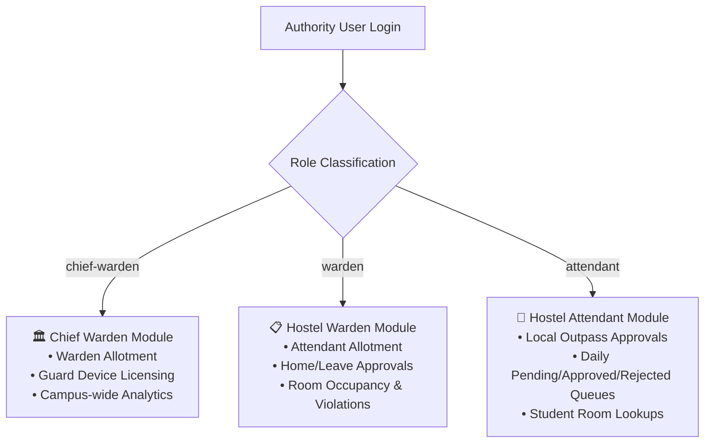

# 🏢 NITH Hostel Management System — Authority & Admin Portal (`hostel-authority`)

[](https://react.dev/)
[](https://www.typescriptlang.org/)
[](https://tanstack.com/query/latest)
[](https://tailwindcss.com/)
[](https://opensource.org/licenses/ISC)

The comprehensive administrative control centre for **NIT Hamirpur Hostel Administration**. It provides a unified, multi-tiered web portal for **Chief Wardens**, **Hostel Wardens**, and **Hostel Attendants / Incharges** to review outpass requests, manage staff allotments, authorize security terminal hardware, and generate audit reports.

---

### 🌐 Related Repositories in the NITH Ecosystem

| Repository | Description | Live GitHub Link |
| :--- | :--- | :--- |
| **`hostel-backend`** | Core REST API Gateway & PostgreSQL Database Engine | [🔗 github.com/workonlly/hostel-backend](https://github.com/workonlly/hostel-backend) |
| **`hostel-frontend`** | Student Web Application (Registration, Outpass Forms & Dynamic QR Gate Pass) | [🔗 github.com/workonlly/hostel-frontend](https://github.com/workonlly/hostel-frontend) |
| **`hostel-guard`** | Offline-First Security Terminal & Gate Scanner (Dexie.js IndexedDB & Fingerprinting) | [🔗 github.com/workonlly/hostel-guard](https://github.com/workonlly/hostel-guard) |

---

## 📑 Table of Contents

- [Role-Based Access Hierarchy](#-role-based-access-hierarchy)
- [Tech Stack](#-tech-stack)
- [Module Breakdown](#-module-breakdown)
  - [1. Chief Warden Administration](#1-chief-warden-administration)
  - [2. Hostel Warden Operations](#2-hostel-warden-operations)
  - [3. Hostel Attendant / Incharge Outpass Triage](#3-hostel-attendant--incharge-outpass-triage)
- [State Management & Caching](#-state-management--caching)
- [Directory Structure](#-directory-structure)
- [Environment Variables](#-environment-variables)
- [Local Setup & Development](#-local-setup--development)
- [Production Build & Docker Deployment](#-production-build--docker-deployment)
- [Exporting Reports & Analytics](#-exporting-reports--analytics)

---

## 👥 Role-Based Access Hierarchy

The application dynamically routes and renders dedicated feature sets based on the authenticated authority role:



---

## 🛠️ Tech Stack

| Technology | Version | Purpose |
| :--- | :--- | :--- |
| **React** | `^19.2.8` | Declarative UI framework with modern concurrent rendering. |
| **TypeScript** | `~6.0.2` | Comprehensive type definitions across API payloads and models. |
| **TanStack React Query** | `^5.101.4` | Server-state caching, automatic background polling, and optimistic updates. |
| **Tailwind CSS** | `^4.3.3` | Modern CSS styling with PostCSS pipeline. |
| **React Router DOM** | `^7.18.2` | Role-protected route trees and nested layouts. |
| **jsPDF & AutoTable** | `^4.2.1` / `^5.0.8` | Client-side export of PDF outpass registers and student rosters. |
| **Lucide React** | `^1.31.0` | Accessible iconography for administrative dashboards. |

---

## 📦 Module Breakdown

### 1. Chief Warden Administration (`src/chief-warden/`)

The Chief Warden holds supreme administrative control over all institute hostels:

- **Hostel Warden Allotment (`WardensAllotment.tsx`):**
  - View all institute hostels (Boys and Girls hostels).
  - Assign or reassign faculty members as Hostel Wardens.
  - Revoke warden privileges or handle inter-hostel transfers.
- **Guard Terminal Device Licensing (`GuardDevices.tsx`):**
  - Register new gate terminal slots with dedicated telephone numbers.
  - Generate unique cryptographic **Activation Codes**.
  - Inspect incoming device hardware fingerprints (Canvas hash, WebGL vendor, IP address, OS).
  - One-click **Approve**, **Block**, or **Revoke** actions for guard hardware.
- **Campus Analytics & Escalations:**
  - High-level overview of total student exits, active outpasses, and late entry violations.

---

### 2. Hostel Warden Operations (`src/warden/`)

Each Warden oversees their assigned hostel:

- **Attendant Allotment (`AttendantsAllotment.tsx`):**
  - Assign and manage daily hostel attendants / incharges.
  - Authorize staff accounts to access the attendant approval queue.
- **Home & Outstation Leave Queue:**
  - Review multi-day outpass applications.
  - Inspect emergency contacts, travel reasons, and parent contact details.
  - Approve or Reject with mandatory remark notes.
- **Student Roster & Room Allocation:**
  - Search students by Roll Number, Name, Room Number, or Academic Year.
  - View physical vs allocated room occupancy numbers.

---

### 3. Hostel Attendant / Incharge Outpass Triage (`src/attendant/`)

Designed for fast-paced daily operations at the hostel desk:

- **Pending Queue (`PendingPage.jsx`):**
  - Displays all incoming **Local Outpasses** submitted by hostel residents before cutoff.
  - Card-based view with student photo, roll number, departure time, and purpose.
  - Modal with quick **Approve** or **Reject** (with predefined or custom reason prompts).
- **Approved Queue (`ApprovedPage.jsx`):**
  - Live log of approved passes for the current day.
  - Real-time indicator showing if the student is currently `In Hostel` or `Checked Out`.
- **Rejected Queue (`RejectedPage.jsx`):**
  - Historical archive of declined requests with rejection remarks for transparency.

---

## 🔄 State Management & Caching

The application uses **TanStack Query v5** for robust server-state synchronization:

```typescript
// src/utils/queryClient.ts
import { QueryClient } from '@tanstack/react-query';

export const queryClient = new QueryClient({
  defaultOptions: {
    queries: {
      staleTime: 1000 * 30, // 30 seconds fresh window
      refetchOnWindowFocus: true,
      retry: 2,
    },
  },
});
```

- When an attendant approves/rejects an outpass, `queryClient.invalidateQueries({ queryKey: ['outpasses'] })` is dispatched, instantly refreshing the queues across all open tabs without full page reloads.

---

## 📁 Directory Structure

```plaintext
hostel-authority/
├── public/                    # Static branding & institute logos
├── src/
│   ├── assets/                # Visual graphics & SVG icons
│   ├── auth/                  # Authority login form & token store
│   │   └── login.tsx
│   ├── chief-warden/          # Chief Warden modules
│   │   ├── ChiefWardenSidebar.tsx
│   │   ├── GuardDevices.tsx   # Hardware terminal licensing & activation
│   │   ├── WardensAllotment.tsx# Hostel warden assignments
│   │   ├── chief-warden.tsx   # Chief Warden root dashboard
│   │   └── warden.tsx
│   ├── warden/                # Hostel Warden modules
│   │   ├── AttendantsAllotment.tsx # Hostel attendant assignments
│   │   ├── WardenSidebar.tsx
│   │   └── warden.tsx         # Warden root dashboard & leave queue
│   ├── attendant/             # Hostel Incharge triage modules
│   │   ├── AdminLayout.tsx    # Shell with AttendantSidebar & header
│   │   ├── AttendantSidebar.tsx
│   │   ├── PendingPage.jsx    # Real-time pending outpass queue
│   │   ├── ApprovedPage.jsx   # Live approved passes & status
│   │   ├── RejectedPage.jsx   # Declined passes with remarks
│   │   ├── DetailCard.jsx     # Student outpass summary card
│   │   ├── InstructionBox.jsx # Hostel guidelines & rules banner
│   │   └── OutpassModal.jsx   # Action modal for approve/reject
│   ├── utils/                 # Utilities & API helpers
│   │   ├── api.js             # API request client
│   │   ├── api.d.ts           # Type definitions
│   │   ├── hostels.ts         # Hostel list metadata
│   │   └── queryClient.ts     # TanStack Query configuration
│   ├── App.css
│   ├── App.tsx                # Role-based router guards
│   ├── index.css              # Tailwind CSS styles
│   └── main.tsx
├── Dockerfile                 # Production multi-stage Docker build
├── nginx.conf                 # Nginx SPA history fallback config
├── package.json
└── tsconfig.json
```

---

## ⚙️ Environment Variables

Create a `.env` file in `hostel-authority/`:

```env
# Backend API Base Endpoint
VITE_API_URL=http://localhost:4000/api
```

Production setting:
```env
VITE_API_URL=https://hostel-backend-cveq.onrender.com/api
```

---

## 🚀 Local Setup & Development

```bash
# 1. Navigate to directory
cd hostel-authority

# 2. Install dependencies
npm install

# 3. Create .env configuration
echo "VITE_API_URL=http://localhost:4000/api" > .env

# 4. Start Vite development server
npm run dev
```

Visit **`http://localhost:5174`** and log in with your authority credentials.

---

## 🐳 Production Build & Docker Deployment

### 1. Standalone Build
```bash
npm run build
npm run preview
```

### 2. Docker Container Deployment

```bash
# Build the Docker image
docker build -t nith-hostel-authority .

# Run on port 5174
docker run -d -p 5174:80 --name nith-authority nith-hostel-authority
```

---

## 📊 Exporting Reports & Analytics

Wardens and Chief Wardens can generate instant PDF reports formatted according to NIT Hamirpur administrative guidelines. Powered by `jspdf` and `jspdf-autotable`, the reports include:

1. **Daily Outpass Register:** List of all students on leave, destination, emergency contact, and check-out/check-in timestamps.
2. **Late Return Violation Log:** Filterable by date and hostel for discipline review.
3. **Hostel Occupancy Report:** Room-wise capacity and allotted resident list.
